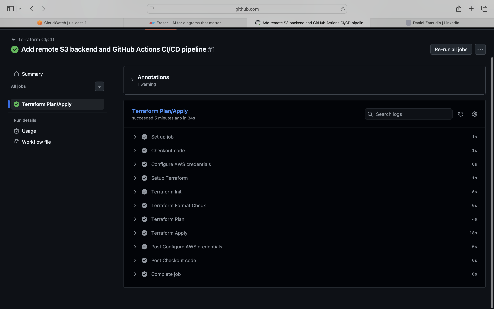
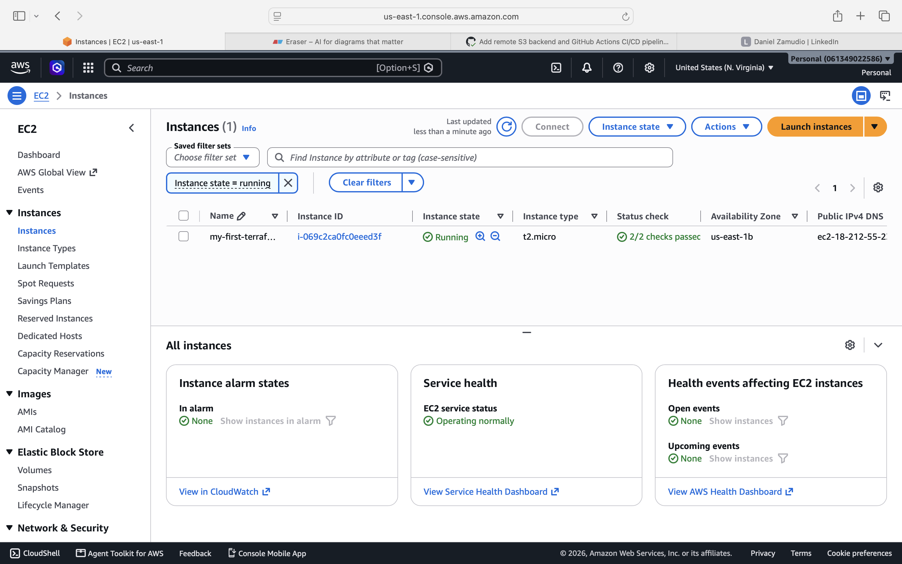

# 🚀 Terraform EC2 Deployment — Automated with CI/CD

> I built this to answer a simple question: what does it look like when infrastructure changes are reviewed and deployed the same way real engineering teams do it — through pull requests, not by SSH-ing in and running commands by hand?

This project provisions an AWS EC2 instance with Terraform, but the real story is the **pipeline**: every code change is automatically planned, checked, and — once merged — deployed, with zero manual `terraform apply` required.


---

## 🏗️ How It Works

1. I push code to GitHub
2. GitHub Actions automatically spins up, runs `terraform init` and `terraform plan` — so I (or anyone reviewing) can see exactly what will change *before* it happens
3. On merge to `main`, the pipeline runs `terraform apply` — no one has to log into AWS or run a command by hand
4. Terraform's state lives remotely in S3, locked via DynamoDB, so the pipeline and my local machine are always looking at the same source of truth

---

## ✅ What This Demonstrates

| Skill | Where it shows up |
|---|---|
| Infrastructure as Code | Full `main.tf` / `variables.tf` / `outputs.tf` structure |
| Remote state + locking | S3 backend + DynamoDB table, shared between local and CI |
| CI/CD for infrastructure | `.github/workflows/terraform.yml` — plan on PR, apply on merge |
| Secure credential handling | AWS keys stored as encrypted GitHub Actions secrets, never in code |
| Dynamic resource lookup | `data` source fetches the latest Amazon Linux AMI automatically |

---

## 📸 Proof It Works

**The pipeline running every step successfully — including the live `apply`:**


**The EC2 instance it created, visible in the AWS Console:**


---

## 🚦 Usage

**Automated (recommended):** open a pull request. The pipeline runs `plan` automatically. Merge to `main`, and `apply` runs on its own.

**Manual (local):**
```bash
terraform init
terraform plan
terraform apply
```

Tear down when finished:
```bash
terraform destroy
```

---

## 💰 Cost

`t2.micro` is free-tier eligible (750 hrs/month on a new AWS account). The S3 + DynamoDB backend costs fractions of a cent per month and is designed to persist as shared infrastructure across projects.

---

## 🛠️ Tech Stack

**Terraform** 1.15 · **AWS** (EC2, S3, DynamoDB) · **GitHub Actions**